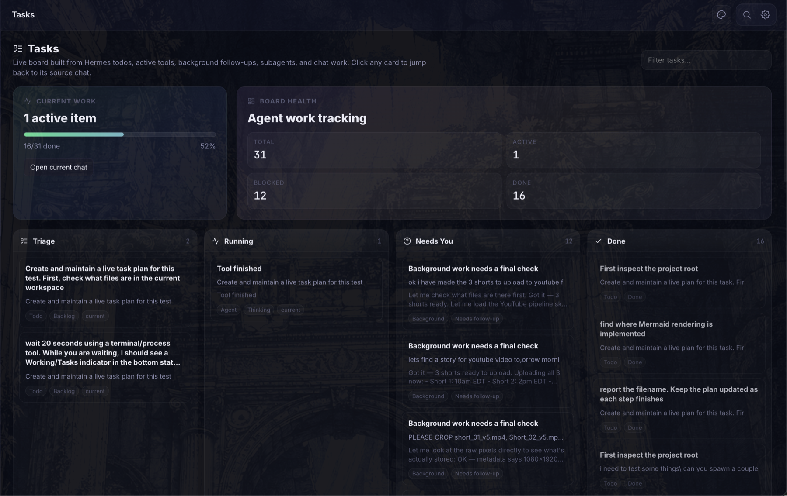

# Hermes UI

**English** · [简体中文](README.zh-CN.md)

The command center for [Hermes Agent](https://github.com/pyrate-llama/hermes-agent) — chat, steer, browse files, manage skills, and monitor everything from a single glassmorphic HTML app.

Built as a single-file HTML application with React 18, Hermes UI provides a full-featured chat interface, real-time log streaming, file browsing, memory inspection, and more — all through a lightweight Python proxy server.


### Chat


### Tasks / Live Work


### Dashboard


### Skills Browser


### Cron Jobs


### MCP Tools


### File Browser


### Terminal


---

## What's new in v3.3.25

**Large chat recovery and browser memory**
- **Sidebar history stays compact** — the browser stores chat metadata instead of full transcripts, avoiding localStorage and tab-memory blowups on large histories
- **Chats hydrate on demand** — opening a chat loads its full transcript from the local server so refreshes do not pull every conversation into the browser at once
- **Refresh races are guarded** — compact or partial browser saves can no longer overwrite full server-side chat mirrors during startup
- **Update button handles release checkouts** — Update & Full Restart can now advance Hermes UI itself when the local install is checked out at an older release tag
- **Stress coverage added** — browser tests now cover refreshing with large chat lists and switching into an inactive compact chat

## What's new in v3.3.24

**Workspace and updater polish**
- **Spaces is no longer a dead end** — non-chat screens now show a clear Chat return button in the header
- **Versions stay visible outside chat** — Spaces and other tool screens show compact Hermes Agent and Hermes UI version chips
- **Agent updates handle release checkouts** — Update & Full Restart can advance a detached Hermes Agent release tag and refresh the editable install metadata
- **Update failures are visible** — failed repo updates now stop before restart and show the underlying pull/install output in Settings

## What's new in v3.3.23

**Agent workspace clarity**
- **Top-bar workspace renamed** — the folder chip now clearly reads as the active Agent Workspace instead of looking like the WebUI runtime directory
- **Useful path display** — the chip shows a shortened workspace path alongside the saved Space selector
- **Manage shortcut** — the chip includes a direct manage action into Spaces so users can add or change workspace folders intentionally

## What's new in v3.3.22

**Release reliability**
- **Truthful update checks** — `/api/version` compares published Releases with repository tags, so a delayed Release cannot leave the UI reporting an older version
- **One version source in the UI** — desktop and composer footers now display the backend version instead of stale hardcoded text
- **Automated releases** — pushing a `v*` tag publishes generated GitHub release notes
- **CI safety net** — Python checks, release consistency, sensitive-data scanning, and a real Chromium startup smoke test run on pushes and pull requests

## What's new in v3.3.18

**Crash recovery context repair**
- **Latest user turns stay visible** — recovery context now preserves the newest user instructions even when tool/status chatter floods the transcript tail
- **Older workflows stay cancelled** — the model prefix now tells Hermes that recent user corrections override stale transcript and memory when they conflict

## What's new in v3.3.16

**Sidebar ordering hotfix**
- **No stale conversation cache** — startup now bypasses browser cache when loading the sidebar conversation list
- **Always sorted state** — conversation updates are normalized through the activity sorter so recently active chats stay at the top after refreshes and state rewrites
- **API cache headers** — JSON responses now send no-store headers so browser resets do not reuse old sidebar data

## What's new in v3.3.15

**Cancellation + sidebar ordering**
- **Cancel cleanup** — cancelled work no longer leaves persistent composer status pills or repeated cancel messages in chat history
- **Context safety** — cancellation markers are filtered out of model context so future turns do not treat them as assistant replies
- **Recent chat ordering** — the sidebar now merges browser and server conversation caches before sorting, so the most recently active chats stay on top after refreshes

## What's new in v3.3.14

**Sidebar stability**
- **Conversation dedupe** — duplicate sidebar rows now collapse by session id on load, save, and live state updates
- **Refresh cleanup** — persisted duplicate rows are repaired by the server instead of reappearing after reload

## What's new in v3.3.13

**Discussion feedback fixes**
- **Firefox performance mode** — disables decorative animations, background overlays, and backdrop filters in Firefox to avoid pinning a CPU core
- **Model picker cleanup** — deduplicates model choices, corrects accidental `gtp-*` entries, and makes custom model selection apply reliably
- **Reasoning + slash menu polish** — preserves spaces in streamed reasoning text, includes plugin skills in slash commands, and improves Dawn theme contrast

## What's new in v3.3.11

Hermes UI 3.3.11 fixes stale compact context that could make an active chat look reset.

**Session continuity**
- **Stale context repair** — if `context_messages` has fewer user turns than the saved transcript and no real compression marker exists, Hermes rebuilds from the full transcript
- **No false reset** — chats with dozens of visible prompts no longer start the next turn from a two-prompt backend tail
- **Health counts fixed** — session health now reports context from the repaired source instead of stale compact state

## What's new in v3.3.10

Hermes UI 3.3.10 aligns normal chat context handling with the reference UI.

**Context continuity**
- **No invisible tail-trim** — normal turns no longer narrow model history to a small local window before Hermes Agent sees it
- **Agent-owned compression** — real context compression is left to Hermes Agent, which emits the visible compression event
- **Repair keeps substance** — browser/server transcript repair rebuilds provider-safe history without dropping older visible turns

## What's new in v3.3.9

Hermes UI 3.3.9 adds video uploads for local/video-capable model workflows such as Kimi.

**Video uploads**
- **Composer video attach** — the file attachment button and drag/drop now accept common video formats
- **Workspace upload path** — videos are saved into the active workspace's `uploads/` folder and attached to the prompt by local path
- **Binary-safe prompts** — video bytes are not inlined into chat history; Hermes receives the saved file path, MIME type, and size

## What's new in v3.3.8

Hermes UI 3.3.8 fixes silent context narrowing in short chats with large tool receipts.

**Reference-aligned context selection**
- **Full transcript first** — chats under 40 user prompts rebuild model context from the full backend transcript instead of stale `context_messages`
- **No silent compaction** — bulky tool/output blobs are truncated for provider safety, but user/project turns stay in context unless real compaction happens
- **Detour recovery** — after side quests like skill edits, Hermes keeps the original project prompts in model context

## What's new in v3.3.7

Hermes UI 3.3.7 makes recovered UI tool receipts visible to model context without pretending they are provider-native tool calls.

**Recovered tool receipt context**
- **Provenance-labeled receipts** — recovered UI `toolCalls` are shown as UI-observed tool events, not forged provider-native `tool_calls`
- **Bad correction pruning** — model context drops broken self-corrections like "I didn't run any tools" when earlier UI-observed tool receipts exist
- **Verification guard** — if UI receipts lack captured results, Hermes must verify the artifact/status with tools before claiming final state

## What's new in v3.3.6

Hermes UI 3.3.6 fixes the browser/server repair path that could drop recent UI tool receipts after a transcript drift repair.

**Tool receipt recovery**
- **UI tool receipts restored** — `/api/session/health` can now recover browser-persisted `toolCalls` from `~/.hermes/ui-conversations.json` when the server session is missing them
- **Equal-count repair** — repair now runs when the browser has tool evidence missing from the server, even if both sides have the same number of user prompts
- **Reference-aligned authority split** — browser text can repair missing visible transcript text, but it no longer replaces richer backend tool history

## What's new in v3.3.5

Hermes UI 3.3.5 fixes a follow-up memory bug where Hermes could see a prior "work completed" transcript but reject it because tool evidence was missing from the repaired context.

**Transcript/tool evidence repair**
- **No instant self-contradiction** — if prior transcript says work finished but tool metadata is missing, Hermes now treats it as unverified prior state and verifies with tools instead of forgetting the topic or denying the previous turn
- **Tool-safe browser repair** — browser-ahead transcript repair now preserves existing server-side `tool_calls` and `tool` messages instead of replacing them with a simplified browser transcript
- **API history preservation** — the frontend now sends API-safe tool messages and tool-call fields back to the server so future repairs keep real work evidence intact

## What's new in v3.3.4

Hermes UI 3.3.4 is a session-memory hotfix. It tightens the browser/server transcript repair so the compacted model context also receives the latest visible turns before Hermes answers.

**Session context repair**
- **Latest-turn memory repair** — browser-ahead transcript repair now refreshes the model-facing context tail too, preventing stale compact context from making Hermes forget the previous prompt/work
- **Reference-aligned merge guards** — workspace-prefixed agent echoes and checkpointed current-user turns are deduped when compacted context is merged back into the visible transcript
- **Server health endpoint** — `/api/session/health` reports server, browser, and compacted-context message counts for easier debugging
- **Cleaner Tasks board** — Done receipts now age out after 2 hours, Needs You/blocked receipts after 12 hours, and the Tasks copy clarifies that it is current/recent work
- **Privacy check** — release diff was checked for obvious token/API-key/personal-path leaks before shipping

## What's new in v3.3.3

Hermes UI 3.3.3 is a session safety and Tasks cleanup patch. It adds a quiet browser/server transcript health check before each chat turn and trims stale task receipts so the board stays focused on current work.

**Session safety + task cleanup**
- **Transcript safety check** — before each send, the browser-visible transcript is compared with the server session and safely repaired if the browser has newer visible chat history
- **Server health endpoint** — `/api/session/health` reports server, browser, and compacted-context message counts for easier debugging
- **Cleaner Tasks board** — Done receipts now age out after 2 hours, Needs You/blocked receipts after 12 hours, and the Tasks copy clarifies that it is current/recent work

## What's new in v3.3.2

Hermes UI 3.3.2 is a live-work reliability patch. It makes background/process work harder to miss, flags local-work claims when no tool ran, and keeps task status visible near the composer instead of letting it scroll away.

**Live work visibility**
- **Composer work banner** — active Hermes work and task follow-ups now stay visible directly above the message box with a quick Open Tasks action
- **Tool honesty guard** — local file/process claims with no tool call are flagged in chat so users do not mistake narrated work for completed work
- **Tasks screenshot** — README now shows the Tasks board and live work tracking flow

## What's new in v3.3.1

Hermes UI 3.3.1 is a session-memory hotfix. It aligns the chat stream lifecycle more closely with the reference UI so context compression and session rotation do not leave the visible UI chat attached to a stale shorter backend session.

**Session durability hotfix**
- **Compression session aliases** — when Hermes rotates a session after context compression, the UI proxy now remembers the old ID points to the new canonical ID, even across proxy restarts
- **Frontend session handoff** — the stream handshake now carries the canonical session ID through compression, cancel/error, approval, and done events
- **History drift repair** — if the visible UI transcript is clearly longer than the server session file, the server repairs from the frontend transcript instead of answering from missing context

## What's new in v3.3

Hermes UI 3.3 is a polish and durability release. It makes the app easier to read at a glance, steadier on long-running work, and better at showing you what Hermes is doing without turning the interface into clutter.

**Health + operational visibility**
- **Health screen** — consolidated Hermes heartbeat, agent/model/provider status, Scrapling/web extraction status, and redacted recent log snippets
- **Recent log safety** — logs shown in the UI are allowlisted and redacted so tokens and API keys do not leak into the app surface
- **Version/update awareness** — Hermes UI and Hermes Agent update status stay visible in-app without taking over the main workspace
- **Background work monitor** — active tools and "check back later" background work surface in Tasks and show a compact chat notice so users know where to continue
- **Tool honesty guard** — local file/process claims with no tool call are flagged in chat so users do not mistake narrated work for completed work

**Chat performance + usability**
- **Long-chat smoothing** — very large conversations render the newest messages first with a load-older control to reduce browser memory pressure
- **Improved conversation ordering** — recent chats stay easier to scan and recover during active work
- **Pinned chat cleanup** — pinned sessions keep a clear single-star indicator instead of duplicate pin markers

**UI cleanup + branding**
- **Focused sidebar** — the left rail defaults to core work areas first, with secondary tools tucked behind a clearer expander
- **Cleaner composer/footer** — bottom controls are condensed so the message box gets more space
- **Space/profile cleanup** — duplicate workspace controls were removed and the active space now lives in a more sensible spot
- **Hermes Agent branding** — refreshed wordmark/avatar treatment gives the app a more intentional identity

## What's new in v3.2

Hermes UI 3.2 turns the project into a stronger multi-work command center, pairing the v3.1 workspace foundation with live task tracking, GitHub workflow polish, and Hermes Agent 0.12 validation.

**Tasks / Kanban board**
- **Tasks screen** — live Kanban-style board with Backlog, Active, Blocked, and Done columns
- **Automatic task detection** — board cards are derived from Hermes todos, delegated subagent work, and active chat state
- **Source chat jump-back** — click any task card to return to the chat where that work came from
- **Board filtering** — quickly narrow visible work by task text, source chat, kind, or status
- **`/tasks` slash command** — open the Tasks board from the composer
- **Hermes Agent 0.12 validation** — tested against official Hermes Agent v0.12.0 while keeping the board independent of unreleased upstream Kanban APIs

**GitHub / release workflow**
- **GitHub issue shortcuts** — status-bar feedback links open bug reports and feature requests directly
- **Issue templates** — GitHub now has dedicated bug report and feature request templates
- **Version/update health** — Hermes UI and Hermes Agent update status are surfaced in-app

**Operations + performance follow-up**
- **Health screen** — consolidated Hermes heartbeat, agent/model/provider status, Scrapling/web extraction status, and redacted recent log snippets
- **Long-chat smoothing** — very large conversations render the newest messages first with a load-older control to reduce browser memory pressure

**Deployment safety**
- **Optional LAN password auth** — set `HERMES_UI_PASSWORD` before exposing Hermes UI beyond localhost
- **Local artifact protection** — personal launchers and local agent state stay out of releases

## What's new in v3.1

Hermes UI 3.1 is a workflow release: it makes the app feel more like a daily command center for real projects instead of a single chat surface.

**Spaces / workspaces**
- **Spaces screen** — add, rename, remove, and switch saved workspace roots from the UI
- **Folder picker for new spaces** — choose a folder from Home, Desktop, Documents, Downloads, OneDrive, drives, or the computer root without typing a path
- **Workspace-aware chats** — new chats and side questions carry the active workspace into Hermes as context
- **Workspace-aware file browser** — the Files view follows the active space instead of always browsing `~/.hermes`
- **`/workspace` slash command** — switch the active space by name or path from the composer

**Chat and composer upgrades**
- **Slash command menu** — quick access to common chat actions from the composer
- **Chat profiles** — switch response styles and have the selected profile apply to outgoing messages
- **Per-message model switching** — pick a different chat model from the composer without losing the current conversation context
- **Mermaid rendering** — diagrams render directly in chat messages
- **Helper model controls** — configure helper behavior for image handling and related fallback flows
- **Context meter fix** — context pressure now estimates current visible messages instead of cumulative session counters

**Operations and visibility**
- **Restart tab** — restart, pull, and update controls now live in a dedicated settings area
- **Version + feedback shortcuts** — the status bar shows the running Hermes UI version and links directly to GitHub bug/feature reports
- **Startup interpreter recovery** — `serve_lite.py` detects the wrong Python and relaunches with the Hermes venv when possible
- **Subagent/delegation cards** — delegated work and batch delegation calls are easier to follow in the chat stream
- **Live todo panel polish** — todo panels update more reliably and no longer resurface stale state
- **Local artifact protection** — `.gitignore` now excludes local agent state, handoff notes, and unrelated project artifacts

**Previous v3.0 highlights remain**
- Provider/API-key management, model capability labels, reasoning effort control, and steering during streaming
- Session search, retry/redo, resizable layout, artifact panel, MCP Tools browser, terminal tabs, memory tools, cron jobs, skills browser, themes, and mobile layout support

---

## Features

**Chat Interface**
- SSE streaming with incremental markdown rendering
- Tool call visualization with expandable results
- Message editing and re-sending
- Composer slash commands for common actions
- `/tasks` command for opening the live task board
- Retry / redo from older prompts without deleting later messages
- Session search across titles and message content
- Image paste/drop with native vision passthrough for supported models, plus Gemini fallback when needed
- Switch the chat model from the composer for the next reply while keeping the same conversation context
- Document upload in the composer (.txt, .md, .pdf, .json, .csv, .py, .js, .ts) — RTF auto-converts to plain text
- Pause, steer, and stop controls mid-stream
- Reasoning effort selector in the composer
- Command search (`Ctrl/Cmd+K`) for jumping into session search fast
- Multiple personality modes (default, technical, creative, pirate, kawaii, and more)
- Base System Prompt field in Settings — write your own persona or instructions
- PDF and HTML chat export
- Markdown rendering with syntax-highlighted code blocks and Mermaid diagrams
- Subagent/delegation cards for delegated work

**Dashboard**
- Live auto-refreshing stats (sessions, messages, tools, tokens)
- System info panel (model, provider, uptime, capabilities)
- Hermes configuration overview

**Health**
- One-screen status for Hermes UI, Hermes Agent, configured model/provider, Scrapling/web extraction, and recent local logs
- Recent log snippets are served from an allowlist and redacted before they reach the browser
- Quick links back to Terminal logs and MCP Tools for deeper inspection

**Spaces / Workspaces**
- Save multiple workspace roots and switch between them from the sidebar or Spaces screen
- Add spaces with a cross-platform folder picker instead of typing paths manually
- New chats, side questions, and Files view inherit the active workspace
- `/workspace [name or path]` command for fast switching

**Tasks / Kanban**
- Live board generated from existing Hermes chat signals, not a separate manual task database
- Tracks todos, delegated subagent work, active agent turns, running tool calls, background follow-ups, blocked items, and completed work
- Opens source chats from task cards so users can continue the original work
- Works with Hermes Agent v0.12.0 without depending on the upstream Kanban experiment that was reverted before the 0.12 stable release

**Artifact Panel**
- Dedicated tab in the live right panel (alongside Errors, Web UI, All)
- Auto-detects HTML, SVG, PDF, and CSV output in Hermes responses and renders them live
- Auto-detects file paths Hermes saves to disk (e.g. `~/Desktop/page.html`) and loads them automatically — no need to copy-paste code
- Panel dynamically widens from 320px to 600px when Artifacts tab is active
- Sandboxed iframe rendering for HTML/SVG with full animation and JavaScript support
- Syntax-highlighted code blocks for Python, JS, CSS, and other languages
- Per-artifact Copy and close (✕) buttons
- Manual "Load File" button to open any local HTML/SVG/code file directly in the panel
- Scroll position preserved when switching between tabs

**Terminal**
- Tabbed interface for Shell, Hermes, and Claude Code flows
- Real-time log streaming views for Gateway, Errors, Web UI, and All
- Live connection indicator with line count

**File Browser**
- Browse the active workspace selected in Spaces
- View, edit, create, rename, and delete project files in-place
- Create folders inside the active workspace
- Image preview support

**Sessions**
- Pin important chats to the top of the sidebar
- Archive old chats without deleting them
- View reasoning notes on assistant messages when the model streams them

**Memory Inspector**
- View and edit Hermes internal memory (MEMORY.md, USER.md)
- Live memory usage stats

**Skills Browser**
- Search and browse all installed Hermes skills
- Sort by newest, oldest, or name — see what Hermes has been creating
- Relative timestamps on each skill (e.g. "2h ago", "3d ago")
- Edit installed skills from the UI
- Move skills to local trash instead of hard-deleting them, with restore controls in Skills Safety
- View skill descriptions, tags, and trigger phrases

**Jobs Monitor**
- Track active and recent Hermes sessions
- Message, tool call, and token counts per session
- Auto-refresh every 10 seconds

**MCP Tool Browser**
- Browse all connected MCP servers and their tools
- View tool descriptions and status
- Web Extract/Scrapling status appears inside MCP Tools when Hermes exposes `web_extract` or an optional Scrapling-backed extractor

**UI/UX**
- Glassmorphism design with ambient animated glow
- Collapsible sidebar and right panel
- Resizable left and right columns
- Active space selector in the sidebar and chat header
- System status bar with connection, model, capability pills, memory count, sessions, and context pressure
- Version badge and GitHub feedback menu in the bottom-right status bar
- Sidebar activity indicators for streaming, unread, and recent chats
- Inter + JetBrains Mono typography
- Keyboard shortcuts
- Theme switcher (Midnight, Twilight, Dawn)
- Responsive layout for tablets and mobile phones
- Bottom navigation bar on small screens with quick access to key views
- Touch-optimized targets and safe-area inset support for notched devices

---

## Quick Start

### Prerequisites

- Python 3.8+
- A running [Hermes Agent](https://github.com/pyrate-llama/hermes-agent) instance on `localhost:8642`
- (Optional) [Claude Code CLI](https://docs.anthropic.com/en/docs/claude-code) for the Claude terminal tab

### Install & Run

```bash
# Clone the repo
git clone https://github.com/pyrate-llama/hermes-ui.git
cd hermes-ui

# Start the proxy server with the Hermes venv interpreter
~/.hermes/hermes-agent/venv/bin/python3 serve_lite.py

# Or specify a custom port
~/.hermes/hermes-agent/venv/bin/python3 serve_lite.py --port 8080
```

> **Note:** `serve.py` still exists as a backwards-compatibility shim that prints a deprecation notice and execs `serve_lite.py`. Existing systemd units and launchers that reference `serve.py` will keep working, but new setups should invoke `serve_lite.py` directly.
>
> If you accidentally start `serve_lite.py` with the wrong Python, it will try to re-launch itself with the Hermes venv interpreter automatically.

Open **http://localhost:3333/hermes-ui.html** in your browser.

That's it — no `npm install`, no build step, no dependencies beyond Python's standard library.

### Configuration

The proxy server connects to Hermes at `http://127.0.0.1:8642` by default. To change this, edit the `HERMES` variable at the top of `serve_lite.py`.

Provider keys can be managed directly in **Settings**, including local API-key storage for supported providers. For image analysis fallback on non-vision setups, add your Gemini API key there as well.

### Optional Password Protection

Hermes UI is local-first by default. If you expose it on a LAN, Tailscale network, or shared machine, set `HERMES_UI_PASSWORD` before starting the server:

```bash
HERMES_UI_PASSWORD="choose-a-strong-password" ~/.hermes/hermes-agent/venv/bin/python3 serve_lite.py
```

When this is set, browser API calls require a local login cookie. Leave it unset for the normal no-login localhost experience.

### Optional Chat Model Shortcuts

The composer model picker always includes the active configured model, and you can type a custom model id directly in the picker. To show a reusable quick-pick list for everyone using the UI, set one of these environment variables before starting the server:

```bash
HERMES_UI_MODELS="MiniMax-M2.7,openai/gpt-4o-mini,anthropic/claude-sonnet-4-20250514" ~/.hermes/hermes-agent/venv/bin/python3 serve_lite.py
```

`HERMES_MODEL_OPTIONS` and `HERMES_MODELS` are accepted aliases. The selected model applies to the next chat message and preserves the existing conversation.

### Optional Web Extract / Scrapling

Hermes UI can surface Web Extract when Hermes exposes `web_extract` through MCP tools. [Scrapling](https://github.com/D4Vinci/Scrapling) is the preferred extraction backend when connected, but Hermes UI keeps the generic Hermes `web_extract` fallback visible so the app still works for everyone without requiring heavier scraping/browser dependencies.

If web extraction is connected, Hermes UI highlights it inside **MCP Tools**. The status card distinguishes **Scrapling Active** from **Hermes Fallback** so users can tell whether Scrapling is actually being used without adding another permanent sidebar tab. If you want to add Scrapling specifically, a common MCP launch command is:

```bash
uvx scrapling mcp
```

After enabling web extraction in Hermes tool configuration, restart or refresh Hermes tool discovery, then ask Hermes from chat to extract, summarize, monitor, or gather structured data from a URL.

### Using OpenRouter or Custom Inference Endpoints

Hermes supports any OpenAI-compatible API endpoint, which means you can use [OpenRouter](https://openrouter.ai) to access Claude, GPT-4, Llama, Mistral, and dozens of other models through a single API key.

In your `~/.hermes/config.yaml`, set your inference endpoint and API key:

```yaml
inference:
  base_url: https://openrouter.ai/api/v1
  api_key: sk-or-v1-your-openrouter-key
  model: anthropic/claude-sonnet-4-20250514
```

This also works with other compatible providers like [LiteLLM](https://github.com/BerriAI/litellm) (self-hosted proxy), [Ollama](https://ollama.ai) (`http://localhost:11434/v1`), or any endpoint that speaks the OpenAI chat completions format.

---

## Remote Access (Tailscale)

Access Hermes UI from your phone, tablet, or any device using [Tailscale](https://tailscale.com) — a zero-config mesh VPN built on WireGuard. No ports exposed to the internet, no DNS to configure, all traffic encrypted end-to-end.

1. **Install Tailscale on your server** (the machine running Hermes):
   ```bash
   brew install tailscale    # macOS
   # or: curl -fsSL https://tailscale.com/install.sh | sh   # Linux
   tailscale up
   ```

2. **Install Tailscale on your phone/other devices** — download the app (iOS/Android) and sign in with the same account.

3. **Connect** — find your server's Tailscale IP (`tailscale ip`) and open:
   ```
   http://100.x.x.x:3333/hermes-ui.html
   ```

4. **Optional: HTTPS via Tailscale Serve** — get a real certificate and clean URL:
   ```bash
   tailscale serve --bg 3333
   # Accessible at https://your-machine.tail1234.ts.net
   ```

A built-in setup guide is also available in the app under **Settings > Remote Access**.

---

## Architecture

```
┌─────────────┐    ┌────────────────┐    ┌──────────────────┐
│  Browser     │───▶│  serve_lite.py │───▶│  Hermes Agent    │
│  (React 18)  │    │  port 3333     │    │  port 8642       │
│              │◀───│  proxy +       │◀───│  (WebAPI)        │
│  Single HTML │    │  log stream    │    │                  │
└─────────────┘    └────────────────┘    └──────────────────┘
```

- **`hermes-ui.html`** — The entire frontend in a single file: React components, CSS, and markup. Uses Babel standalone for JSX compilation in the browser.
- **`serve_lite.py`** — A lightweight Python proxy (stdlib only, no pip dependencies) that serves static files, proxies the `/api/chat/*` two-step SSE flow to the Hermes agent, streams logs via SSE, provides shell/Claude CLI execution, and enables file browsing/editing within `~/.hermes`. This is the canonical server.
- **`serve.py`** — Backwards-compatibility shim. Prints a deprecation notice and execs `serve_lite.py`. Kept so existing systemd units and launchers don't break.

### CDN Dependencies

All loaded from cdnjs.cloudflare.com at runtime:

| Library | Version | Purpose |
|---------|---------|---------|
| React | 18.2.0 | UI framework |
| React DOM | 18.2.0 | DOM rendering |
| Babel Standalone | 7.23.9 | JSX compilation |
| marked | 11.1.1 | Markdown parsing |
| highlight.js | 11.9.0 | Code syntax highlighting |
| Inter | — | UI typography (Google Fonts) |
| JetBrains Mono | — | Code/terminal typography (Google Fonts) |

---

## Keyboard Shortcuts

| Shortcut | Action |
|----------|--------|
| `Enter` | Send message |
| `Shift+Enter` | New line in input |
| `?` | Show keyboard shortcuts |
| `Ctrl/Cmd+K` | Focus search |
| `Ctrl/Cmd+N` | New chat |
| `Ctrl/Cmd+\` | Toggle sidebar |
| `Ctrl/Cmd+E` | Export chat as markdown |
| `Escape` | Close modals / dismiss |

---

## Themes

Hermes UI ships with three built-in themes, accessible via the theme switcher in the header:

- **Midnight** (default) — Deep indigo/purple glassmorphism with ambient purple and green glow
- **Twilight** — Warm amber/gold tones with copper accents
- **Dawn** — Soft light theme with blue-gray tones for daytime use

---

## Troubleshooting

**Hermes stops responding / hangs after a few messages**

If Hermes responds once or twice then goes silent, check your `~/.hermes/config.yaml` for this bug in the context compression config:

```yaml
compression:
  summary_base_url: null   # ← this causes a 404 and hangs the agent
```

Fix it by setting `summary_base_url` to match your inference provider's base URL. For MiniMax:

```yaml
compression:
  summary_base_url: https://api.minimax.io/anthropic
```

Then restart Hermes: `hermes restart`

---

**Chat hangs, times out silently, or returns 404 on `/api/chat/start`**

Two common causes:

1. **You're running the old `serve.py` directly from a stale checkout or a systemd unit.** The current client (`hermes-ui.html`) talks to the two-step `/api/chat/*` SSE API, which only `serve_lite.py` implements. If your launcher calls `python3 serve.py`, pull the repo — the new `serve.py` is a shim that forwards to `serve_lite.py` and will keep working. If you're on an older checkout, update your unit to call `serve_lite.py` directly:

   ```
   ExecStart=/usr/bin/python3 /path/to/hermes-ui/serve_lite.py
   ```

2. **The Hermes agent itself (port 8642) isn't reachable.** `serve_lite.py` on 3333 is only a proxy — it needs the agent running on 8642. Check `curl http://127.0.0.1:8642/health`.

If you still see silent hangs, open the browser console — the client now surfaces SSE errors as visible chat messages rather than stalling.

---

## License

MIT — see [LICENSE](LICENSE).

---

## Credits

Built by [Pyrate Llama](https://pyrate-llama.com) with help from Claude (Anthropic).

Powered by [Hermes Agent](https://github.com/pyrate-llama/hermes-agent).
