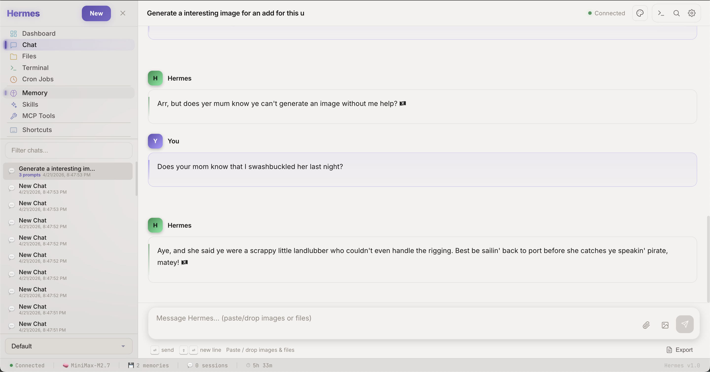

# Hermes UI

**English** · [简体中文](README.zh-CN.md)

A sleek, glassmorphic web interface for [Hermes Agent](https://github.com/pyrate-llama/hermes-agent) — your self-hosted AI assistant.

Built as a single-file HTML application with React 18, Hermes UI provides a full-featured chat interface, real-time log streaming, file browsing, memory inspection, and more — all through a lightweight Python proxy server.


### Chat


### Dashboard


### Skills Browser


### Cron Jobs


### MCP Tools


### File Browser


### Light Theme


---

## What's new in v2.5

~45 commits since v2.0 (April 2026).

**New features**
- **Command palette** (`Ctrl/Cmd+K`) — fuzzy search across chats and skills (nesq-style)
- **Document upload in chat** — drop `.txt`, `.md`, `.pdf`, `.json`, `.csv`, `.py`, `.js`, `.ts` files directly into the composer
- **Artifact panel** — auto-detects HTML, SVG, PDF, and CSV output and renders live previews in a widening right panel
- **MCP Tools modal** — categorized view of all connected servers (Web, Browser, Terminal, Files, Code, etc.)
- **Base System Prompt field** — write your own persona or instructions in Settings, applied to new chats
- **`~/.hermes/extra_system_prompt.md` addon** (opt-in) — prepend a user-local prompt snippet without forking the repo
- **Karpathy behavioral guidelines toggle** (OFF by default, editable at `behavioral_guidelines.md`)
- **Compaction marker SSE event** — visible indicator when context compression fires mid-stream
- **Simplified Chinese README** and an in-app language switcher

**Visual refresh**
- New inline SVG icon set throughout
- Segmented toolbar pill, ambient depth layers (vignette + noise + third glow blob)
- Color-grouped sidebar icons, regrouped sidebar sections, tightened vertical density
- Dashboard card polish with refreshed typography
- Message bubble and user-avatar gradient refinements
- Light-theme code block readability fix (hljs stylesheet swap)
- Palette-icon theme dropdown replacing the three raw theme swatches

**Skills**
- Delete button wired to a matching DELETE endpoint
- Edit/save for skill contents
- Details modal wired to a working endpoint
- Newest-first sort via a new `/skills/dates` endpoint with relative timestamps

**Stability & bug fixes**
- Composer no longer shows "send" when a stream is actually running (state-desync unstick)
- Auto-pause-send on `Enter` while streaming
- Chat list stays visible across non-chat views
- Scroll position preserved when switching between views
- Session-id rotation after compression re-keys the UI correctly
- Tool calls are no longer stripped from stored sessions
- RTF drag-drop auto-converts to plain text
- Theme dropdown no longer clipped by the header's containing block
- `serve_lite.py` fails loudly on the wrong Python interpreter
- `serve.py` is now a shim that forwards to `serve_lite.py` — existing systemd units keep working

---

## Features

**Chat Interface**
- SSE streaming with real-time token display
- Tool call visualization with expandable results
- Message editing and re-sending
- Image paste/drop with Gemini vision analysis
- Document upload in the composer (.txt, .md, .pdf, .json, .csv, .py, .js, .ts) — RTF auto-converts to plain text
- Pause, interject, and stop controls mid-stream (auto-pause on `Enter` while streaming)
- Command palette (`Ctrl/Cmd+K`) for fuzzy search across chats and skills
- Multiple personality modes (default, technical, creative, pirate, kawaii, and more)
- Base System Prompt field in Settings — write your own persona or instructions
- PDF and HTML chat export
- Markdown rendering with syntax-highlighted code blocks

**Dashboard**
- Live auto-refreshing stats (sessions, messages, tools, tokens)
- System info panel (model, provider, uptime)
- Hermes configuration overview

**Artifact Panel**
- Dedicated tab in the live right panel (alongside Errors, Web UI, All)
- Auto-detects HTML, SVG, PDF, and CSV output in Hermes responses and renders them live
- Auto-detects file paths Hermes saves to disk (e.g. `~/Desktop/page.html`) and loads them automatically — no need to copy-paste code
- Panel dynamically widens from 320px to 600px when Artifacts tab is active
- Sandboxed iframe rendering for HTML/SVG with full animation and JavaScript support
- Syntax-highlighted code blocks for Python, JS, CSS, and other languages
- Per-artifact Copy and close (✕) buttons
- Manual "Load File" button to open any local HTML/SVG/code file directly in the panel
- Scroll position preserved when switching between tabs

**Terminal**
- Tabbed interface: Gateway, Errors, Web UI, All — real-time log streaming via SSE
- Live connection indicator with line count

**File Browser**
- Browse `~/.hermes` directory tree
- View and edit config files, logs, and memory files in-place
- Image preview support

**Memory Inspector**
- View and edit Hermes internal memory (MEMORY.md, USER.md)
- Live memory usage stats

**Skills Browser**
- Search and browse all installed Hermes skills
- Sort by newest, oldest, or name — see what Hermes has been creating
- Relative timestamps on each skill (e.g. "2h ago", "3d ago")
- View skill descriptions, tags, and trigger phrases

**Jobs Monitor**
- Track active and recent Hermes sessions
- Message, tool call, and token counts per session
- Auto-refresh every 10 seconds

**MCP Tool Browser**
- Browse all connected MCP servers and their tools
- View tool descriptions and status

**UI/UX**
- Glassmorphism design with ambient animated glow
- Collapsible sidebar and right panel
- System status bar (connection, model, memory count, sessions)
- Inter + JetBrains Mono typography
- Keyboard shortcuts
- Theme switcher (Midnight, Twilight, Dawn)
- Responsive layout for tablets and mobile phones
- Bottom navigation bar on small screens with quick access to key views
- Touch-optimized targets and safe-area inset support for notched devices

---

## Quick Start

### Prerequisites

- Python 3.8+
- A running [Hermes Agent](https://github.com/pyrate-llama/hermes-agent) instance on `localhost:8642`
- (Optional) [Claude Code CLI](https://docs.anthropic.com/en/docs/claude-code) for the Claude terminal tab

### Install & Run

```bash
# Clone the repo
git clone https://github.com/pyrate-llama/hermes-ui.git
cd hermes-ui

# Start the proxy server
python3 serve_lite.py

# Or specify a custom port
python3 serve_lite.py --port 8080
```

> **Note:** `serve.py` still exists as a backwards-compatibility shim that prints a deprecation notice and execs `serve_lite.py`. Existing systemd units and launchers that reference `serve.py` will keep working, but new setups should invoke `serve_lite.py` directly.

Open **http://localhost:3333/hermes-ui.html** in your browser.

That's it — no `npm install`, no build step, no dependencies beyond Python's standard library.

### Configuration

The proxy server connects to Hermes at `http://127.0.0.1:8642` by default. To change this, edit the `HERMES` variable at the top of `serve_lite.py`.

For image analysis (paste/drop images in chat), add your Gemini API key in the Settings modal within the UI.

### Using OpenRouter or Custom Inference Endpoints

Hermes supports any OpenAI-compatible API endpoint, which means you can use [OpenRouter](https://openrouter.ai) to access Claude, GPT-4, Llama, Mistral, and dozens of other models through a single API key.

In your `~/.hermes/config.yaml`, set your inference endpoint and API key:

```yaml
inference:
  base_url: https://openrouter.ai/api/v1
  api_key: sk-or-v1-your-openrouter-key
  model: anthropic/claude-sonnet-4-20250514
```

This also works with other compatible providers like [LiteLLM](https://github.com/BerriAI/litellm) (self-hosted proxy), [Ollama](https://ollama.ai) (`http://localhost:11434/v1`), or any endpoint that speaks the OpenAI chat completions format.

---

## Remote Access (Tailscale)

Access Hermes UI from your phone, tablet, or any device using [Tailscale](https://tailscale.com) — a zero-config mesh VPN built on WireGuard. No ports exposed to the internet, no DNS to configure, all traffic encrypted end-to-end.

1. **Install Tailscale on your server** (the machine running Hermes):
   ```bash
   brew install tailscale    # macOS
   # or: curl -fsSL https://tailscale.com/install.sh | sh   # Linux
   tailscale up
   ```

2. **Install Tailscale on your phone/other devices** — download the app (iOS/Android) and sign in with the same account.

3. **Connect** — find your server's Tailscale IP (`tailscale ip`) and open:
   ```
   http://100.x.x.x:3333/hermes-ui.html
   ```

4. **Optional: HTTPS via Tailscale Serve** — get a real certificate and clean URL:
   ```bash
   tailscale serve --bg 3333
   # Accessible at https://your-machine.tail1234.ts.net
   ```

A built-in setup guide is also available in the app under **Settings > Remote Access**.

---

## Architecture

```
┌─────────────┐    ┌────────────────┐    ┌──────────────────┐
│  Browser     │───▶│  serve_lite.py │───▶│  Hermes Agent    │
│  (React 18)  │    │  port 3333     │    │  port 8642       │
│              │◀───│  proxy +       │◀───│  (WebAPI)        │
│  Single HTML │    │  log stream    │    │                  │
└─────────────┘    └────────────────┘    └──────────────────┘
```

- **`hermes-ui.html`** — The entire frontend in a single file: React components, CSS, and markup. Uses Babel standalone for JSX compilation in the browser.
- **`serve_lite.py`** — A lightweight Python proxy (stdlib only, no pip dependencies) that serves static files, proxies the `/api/chat/*` two-step SSE flow to the Hermes agent, streams logs via SSE, provides shell/Claude CLI execution, and enables file browsing/editing within `~/.hermes`. This is the canonical server.
- **`serve.py`** — Backwards-compatibility shim. Prints a deprecation notice and execs `serve_lite.py`. Kept so existing systemd units and launchers don't break.

### CDN Dependencies

All loaded from cdnjs.cloudflare.com at runtime:

| Library | Version | Purpose |
|---------|---------|---------|
| React | 18.2.0 | UI framework |
| React DOM | 18.2.0 | DOM rendering |
| Babel Standalone | 7.23.9 | JSX compilation |
| marked | 11.1.1 | Markdown parsing |
| highlight.js | 11.9.0 | Code syntax highlighting |
| Inter | — | UI typography (Google Fonts) |
| JetBrains Mono | — | Code/terminal typography (Google Fonts) |

---

## Keyboard Shortcuts

| Shortcut | Action |
|----------|--------|
| `Enter` | Send message |
| `Shift+Enter` | New line in input |
| `?` | Show keyboard shortcuts |
| `Ctrl/Cmd+K` | Focus search |
| `Ctrl/Cmd+N` | New chat |
| `Ctrl/Cmd+\` | Toggle sidebar |
| `Ctrl/Cmd+E` | Export chat as markdown |
| `Escape` | Close modals / dismiss |

---

## Themes

Hermes UI ships with three built-in themes, accessible via the theme switcher in the header:

- **Midnight** (default) — Deep indigo/purple glassmorphism with ambient purple and green glow
- **Twilight** — Warm amber/gold tones with copper accents
- **Dawn** — Soft light theme with blue-gray tones for daytime use

---

## Troubleshooting

**Hermes stops responding / hangs after a few messages**

If Hermes responds once or twice then goes silent, check your `~/.hermes/config.yaml` for this bug in the context compression config:

```yaml
compression:
  summary_base_url: null   # ← this causes a 404 and hangs the agent
```

Fix it by setting `summary_base_url` to match your inference provider's base URL. For MiniMax:

```yaml
compression:
  summary_base_url: https://api.minimax.io/anthropic
```

Then restart Hermes: `hermes restart`

---

**Chat hangs, times out silently, or returns 404 on `/api/chat/start`**

Two common causes:

1. **You're running the old `serve.py` directly from a stale checkout or a systemd unit.** The current client (`hermes-ui.html`) talks to the two-step `/api/chat/*` SSE API, which only `serve_lite.py` implements. If your launcher calls `python3 serve.py`, pull the repo — the new `serve.py` is a shim that forwards to `serve_lite.py` and will keep working. If you're on an older checkout, update your unit to call `serve_lite.py` directly:

   ```
   ExecStart=/usr/bin/python3 /path/to/hermes-ui/serve_lite.py
   ```

2. **The Hermes agent itself (port 8642) isn't reachable.** `serve_lite.py` on 3333 is only a proxy — it needs the agent running on 8642. Check `curl http://127.0.0.1:8642/health`.

If you still see silent hangs, open the browser console — the client now surfaces SSE errors as visible chat messages rather than stalling.

---

## License

MIT — see [LICENSE](LICENSE).

---

## Credits

Built by [Pyrate Llama](https://pyrate-llama.com) with help from Claude (Anthropic).

Powered by [Hermes Agent](https://github.com/pyrate-llama/hermes-agent).
