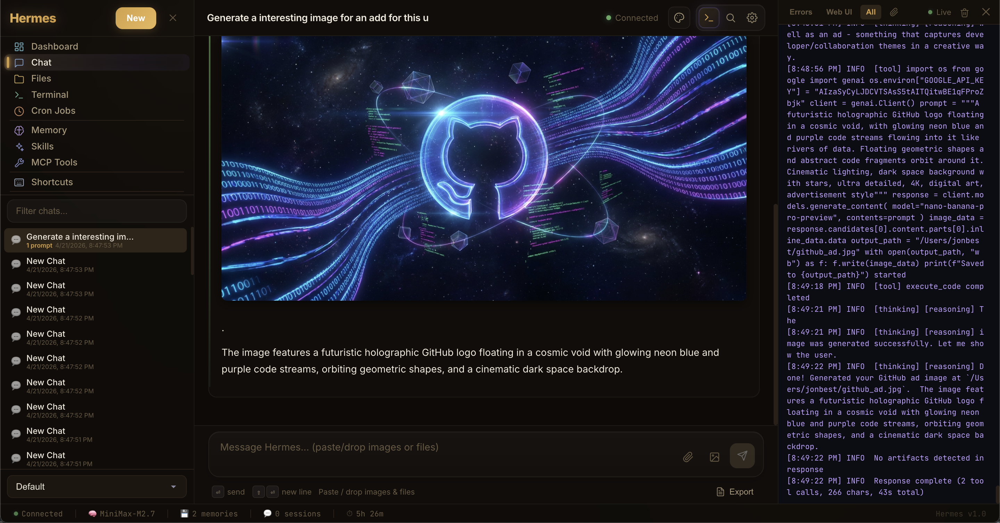
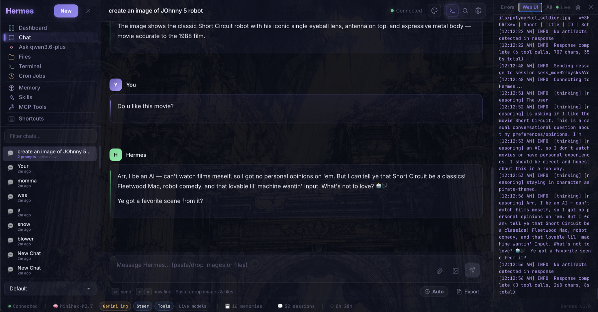
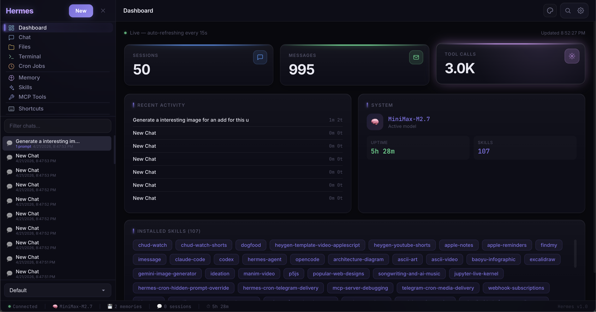
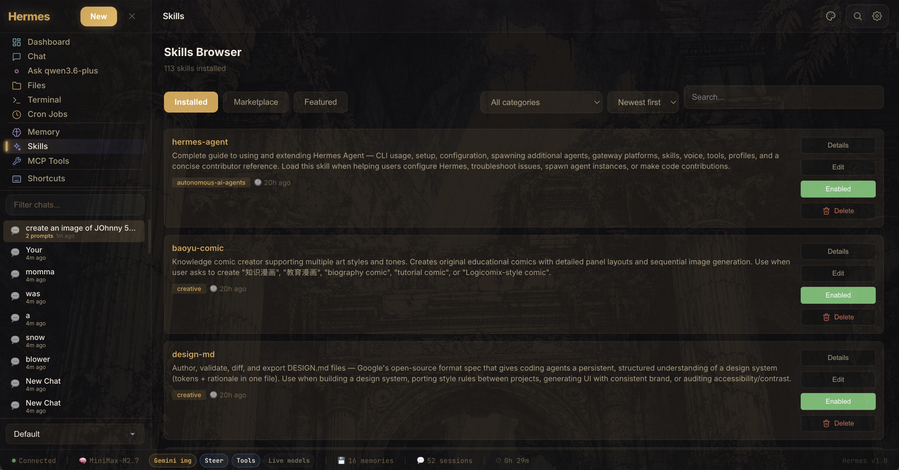
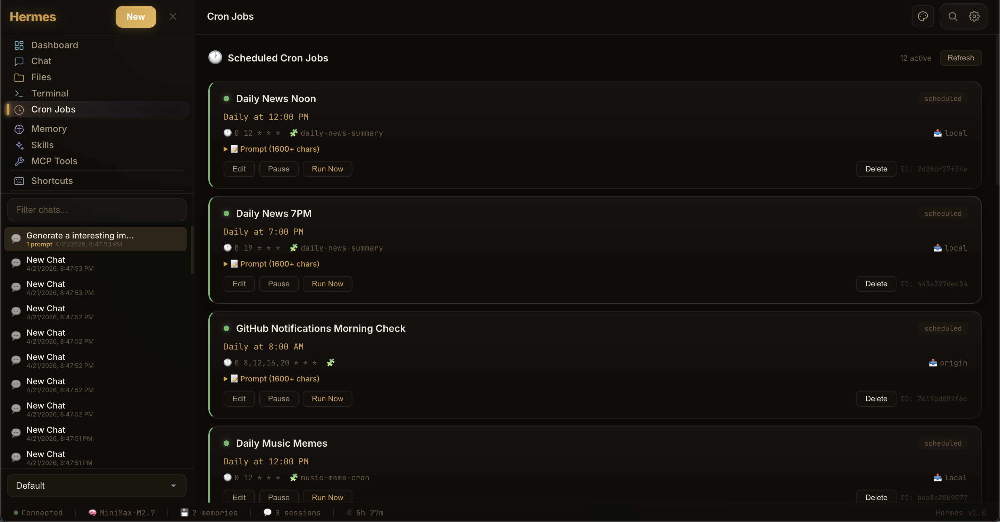
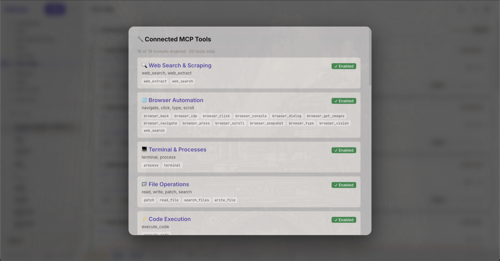
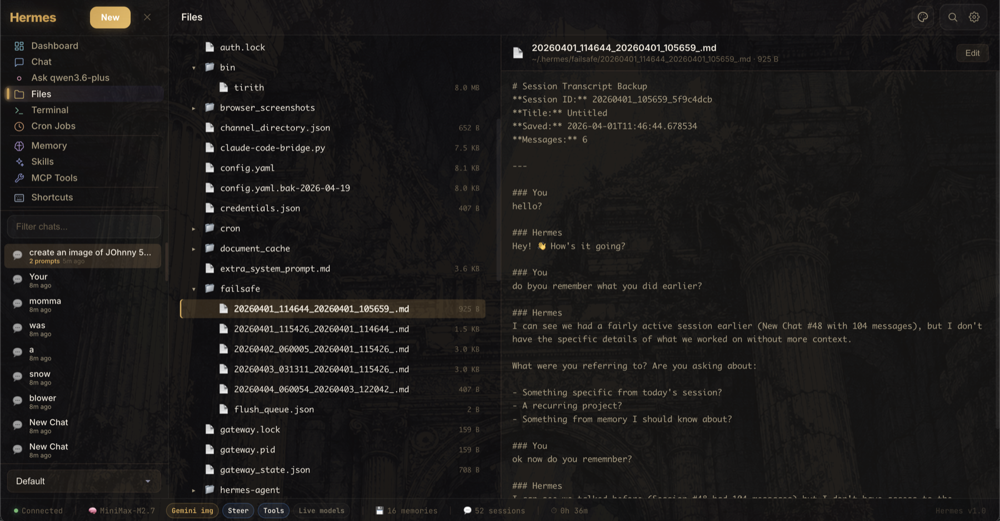
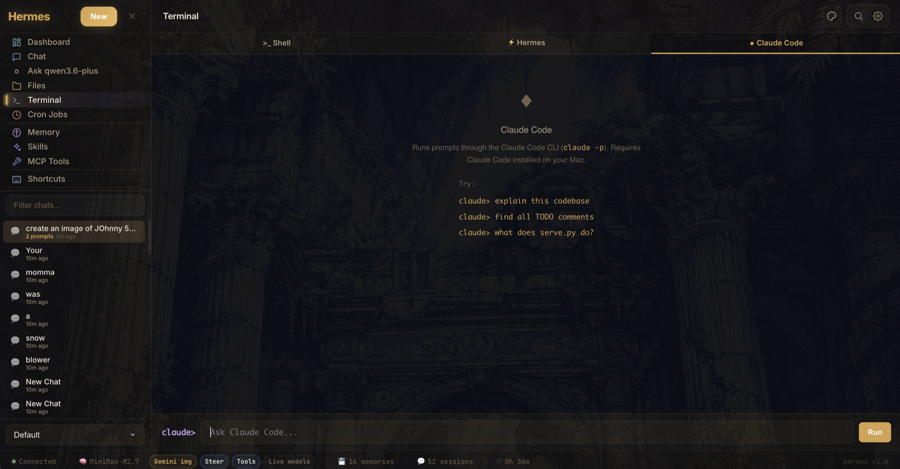

# Hermes UI

**English** · [简体中文](README.zh-CN.md)

The command center for [Hermes Agent](https://github.com/pyrate-llama/hermes-agent) — chat, steer, browse files, manage skills, and monitor everything from a single glassmorphic HTML app.

Built as a single-file HTML application with React 18, Hermes UI provides a full-featured chat interface, real-time log streaming, file browsing, memory inspection, and more — all through a lightweight Python proxy server.


### Chat



### Dashboard


### Skills Browser


### Cron Jobs


### MCP Tools


### File Browser


### Terminal


---

## Unreleased

**Tasks / Kanban board**
- **Tasks screen** — live Kanban-style board with Backlog, Active, Blocked, and Done columns
- **Automatic task detection** — board cards are derived from Hermes todos, delegated subagent work, and active chat state
- **Source chat jump-back** — click any task card to return to the chat where that work came from
- **Board filtering** — quickly narrow visible work by task text, source chat, kind, or status
- **`/tasks` slash command** — open the Tasks board from the composer
- **Hermes Agent 0.12 validation** — tested against official Hermes Agent v0.12.0 while keeping the board independent of unreleased upstream Kanban APIs

## What's new in v3.1

Hermes UI 3.1 is a workflow release: it makes the app feel more like a daily command center for real projects instead of a single chat surface.

**Spaces / workspaces**
- **Spaces screen** — add, rename, remove, and switch saved workspace roots from the UI
- **Folder picker for new spaces** — choose a folder from Home, Desktop, Documents, Downloads, OneDrive, drives, or the computer root without typing a path
- **Workspace-aware chats** — new chats and side questions carry the active workspace into Hermes as context
- **Workspace-aware file browser** — the Files view follows the active space instead of always browsing `~/.hermes`
- **`/workspace` slash command** — switch the active space by name or path from the composer

**Chat and composer upgrades**
- **Slash command menu** — quick access to common chat actions from the composer
- **Chat profiles** — switch response styles and have the selected profile apply to outgoing messages
- **Per-message model switching** — pick a different chat model from the composer without losing the current conversation context
- **Mermaid rendering** — diagrams render directly in chat messages
- **Helper model controls** — configure helper behavior for image handling and related fallback flows
- **Context meter fix** — context pressure now estimates current visible messages instead of cumulative session counters

**Operations and visibility**
- **Restart tab** — restart, pull, and update controls now live in a dedicated settings area
- **Version + feedback shortcuts** — the status bar shows the running Hermes UI version and links directly to GitHub bug/feature reports
- **Startup interpreter recovery** — `serve_lite.py` detects the wrong Python and relaunches with the Hermes venv when possible
- **Subagent/delegation cards** — delegated work and batch delegation calls are easier to follow in the chat stream
- **Live todo panel polish** — todo panels update more reliably and no longer resurface stale state
- **Local artifact protection** — `.gitignore` now excludes local agent state, handoff notes, and unrelated project artifacts

**Previous v3.0 highlights remain**
- Provider/API-key management, model capability labels, reasoning effort control, and steering during streaming
- Session search, retry/redo, resizable layout, artifact panel, MCP Tools browser, terminal tabs, memory tools, cron jobs, skills browser, themes, and mobile layout support

---

## Features

**Chat Interface**
- SSE streaming with incremental markdown rendering
- Tool call visualization with expandable results
- Message editing and re-sending
- Composer slash commands for common actions
- `/tasks` command for opening the live task board
- Retry / redo from older prompts without deleting later messages
- Session search across titles and message content
- Image paste/drop with native vision passthrough for supported models, plus Gemini fallback when needed
- Switch the chat model from the composer for the next reply while keeping the same conversation context
- Document upload in the composer (.txt, .md, .pdf, .json, .csv, .py, .js, .ts) — RTF auto-converts to plain text
- Pause, steer, and stop controls mid-stream
- Reasoning effort selector in the composer
- Command search (`Ctrl/Cmd+K`) for jumping into session search fast
- Multiple personality modes (default, technical, creative, pirate, kawaii, and more)
- Base System Prompt field in Settings — write your own persona or instructions
- PDF and HTML chat export
- Markdown rendering with syntax-highlighted code blocks and Mermaid diagrams
- Subagent/delegation cards for delegated work

**Dashboard**
- Live auto-refreshing stats (sessions, messages, tools, tokens)
- System info panel (model, provider, uptime, capabilities)
- Hermes configuration overview

**Spaces / Workspaces**
- Save multiple workspace roots and switch between them from the sidebar or Spaces screen
- Add spaces with a cross-platform folder picker instead of typing paths manually
- New chats, side questions, and Files view inherit the active workspace
- `/workspace [name or path]` command for fast switching

**Tasks / Kanban**
- Live board generated from existing Hermes chat signals, not a separate manual task database
- Tracks todos, delegated subagent work, active agent turns, blocked items, and completed work
- Opens source chats from task cards so users can continue the original work
- Works with Hermes Agent v0.12.0 without depending on the upstream Kanban experiment that was reverted before the 0.12 stable release

**Artifact Panel**
- Dedicated tab in the live right panel (alongside Errors, Web UI, All)
- Auto-detects HTML, SVG, PDF, and CSV output in Hermes responses and renders them live
- Auto-detects file paths Hermes saves to disk (e.g. `~/Desktop/page.html`) and loads them automatically — no need to copy-paste code
- Panel dynamically widens from 320px to 600px when Artifacts tab is active
- Sandboxed iframe rendering for HTML/SVG with full animation and JavaScript support
- Syntax-highlighted code blocks for Python, JS, CSS, and other languages
- Per-artifact Copy and close (✕) buttons
- Manual "Load File" button to open any local HTML/SVG/code file directly in the panel
- Scroll position preserved when switching between tabs

**Terminal**
- Tabbed interface for Shell, Hermes, and Claude Code flows
- Real-time log streaming views for Gateway, Errors, Web UI, and All
- Live connection indicator with line count

**File Browser**
- Browse the active workspace selected in Spaces
- View, edit, create, rename, and delete project files in-place
- Create folders inside the active workspace
- Image preview support

**Sessions**
- Pin important chats to the top of the sidebar
- Archive old chats without deleting them
- View reasoning notes on assistant messages when the model streams them

**Memory Inspector**
- View and edit Hermes internal memory (MEMORY.md, USER.md)
- Live memory usage stats

**Skills Browser**
- Search and browse all installed Hermes skills
- Sort by newest, oldest, or name — see what Hermes has been creating
- Relative timestamps on each skill (e.g. "2h ago", "3d ago")
- Edit and delete installed skills from the UI
- View skill descriptions, tags, and trigger phrases

**Jobs Monitor**
- Track active and recent Hermes sessions
- Message, tool call, and token counts per session
- Auto-refresh every 10 seconds

**MCP Tool Browser**
- Browse all connected MCP servers and their tools
- View tool descriptions and status
- Web Extract/Scrapling status appears inside MCP Tools when Hermes exposes `web_extract` or an optional Scrapling-backed extractor

**UI/UX**
- Glassmorphism design with ambient animated glow
- Collapsible sidebar and right panel
- Resizable left and right columns
- Active space selector in the sidebar and chat header
- System status bar with connection, model, capability pills, memory count, sessions, and context pressure
- Version badge and GitHub feedback menu in the bottom-right status bar
- Sidebar activity indicators for streaming, unread, and recent chats
- Inter + JetBrains Mono typography
- Keyboard shortcuts
- Theme switcher (Midnight, Twilight, Dawn)
- Responsive layout for tablets and mobile phones
- Bottom navigation bar on small screens with quick access to key views
- Touch-optimized targets and safe-area inset support for notched devices

---

## Quick Start

### Prerequisites

- Python 3.8+
- A running [Hermes Agent](https://github.com/pyrate-llama/hermes-agent) instance on `localhost:8642`
- (Optional) [Claude Code CLI](https://docs.anthropic.com/en/docs/claude-code) for the Claude terminal tab

### Install & Run

```bash
# Clone the repo
git clone https://github.com/pyrate-llama/hermes-ui.git
cd hermes-ui

# Start the proxy server with the Hermes venv interpreter
~/.hermes/hermes-agent/venv/bin/python3 serve_lite.py

# Or specify a custom port
~/.hermes/hermes-agent/venv/bin/python3 serve_lite.py --port 8080
```

> **Note:** `serve.py` still exists as a backwards-compatibility shim that prints a deprecation notice and execs `serve_lite.py`. Existing systemd units and launchers that reference `serve.py` will keep working, but new setups should invoke `serve_lite.py` directly.
>
> If you accidentally start `serve_lite.py` with the wrong Python, it will try to re-launch itself with the Hermes venv interpreter automatically.

Open **http://localhost:3333/hermes-ui.html** in your browser.

That's it — no `npm install`, no build step, no dependencies beyond Python's standard library.

### Configuration

The proxy server connects to Hermes at `http://127.0.0.1:8642` by default. To change this, edit the `HERMES` variable at the top of `serve_lite.py`.

Provider keys can be managed directly in **Settings**, including local API-key storage for supported providers. For image analysis fallback on non-vision setups, add your Gemini API key there as well.

### Optional Password Protection

Hermes UI is local-first by default. If you expose it on a LAN, Tailscale network, or shared machine, set `HERMES_UI_PASSWORD` before starting the server:

```bash
HERMES_UI_PASSWORD="choose-a-strong-password" ~/.hermes/hermes-agent/venv/bin/python3 serve_lite.py
```

When this is set, browser API calls require a local login cookie. Leave it unset for the normal no-login localhost experience.

### Optional Chat Model Shortcuts

The composer model picker always includes the active configured model, and you can type a custom model id directly in the picker. To show a reusable quick-pick list for everyone using the UI, set one of these environment variables before starting the server:

```bash
HERMES_UI_MODELS="MiniMax-M2.7,openai/gpt-4o-mini,anthropic/claude-sonnet-4-20250514" ~/.hermes/hermes-agent/venv/bin/python3 serve_lite.py
```

`HERMES_MODEL_OPTIONS` and `HERMES_MODELS` are accepted aliases. The selected model applies to the next chat message and preserves the existing conversation.

### Optional Web Extract / Scrapling

Hermes UI can surface Web Extract when Hermes exposes `web_extract` through MCP tools. [Scrapling](https://github.com/D4Vinci/Scrapling) is the preferred extraction backend when connected, but Hermes UI keeps the generic Hermes `web_extract` fallback visible so the app still works for everyone without requiring heavier scraping/browser dependencies.

If web extraction is connected, Hermes UI highlights it inside **MCP Tools**. The status card distinguishes **Scrapling Active** from **Hermes Fallback** so users can tell whether Scrapling is actually being used without adding another permanent sidebar tab. If you want to add Scrapling specifically, a common MCP launch command is:

```bash
uvx scrapling mcp
```

After enabling web extraction in Hermes tool configuration, restart or refresh Hermes tool discovery, then ask Hermes from chat to extract, summarize, monitor, or gather structured data from a URL.

### Using OpenRouter or Custom Inference Endpoints

Hermes supports any OpenAI-compatible API endpoint, which means you can use [OpenRouter](https://openrouter.ai) to access Claude, GPT-4, Llama, Mistral, and dozens of other models through a single API key.

In your `~/.hermes/config.yaml`, set your inference endpoint and API key:

```yaml
inference:
  base_url: https://openrouter.ai/api/v1
  api_key: sk-or-v1-your-openrouter-key
  model: anthropic/claude-sonnet-4-20250514
```

This also works with other compatible providers like [LiteLLM](https://github.com/BerriAI/litellm) (self-hosted proxy), [Ollama](https://ollama.ai) (`http://localhost:11434/v1`), or any endpoint that speaks the OpenAI chat completions format.

---

## Remote Access (Tailscale)

Access Hermes UI from your phone, tablet, or any device using [Tailscale](https://tailscale.com) — a zero-config mesh VPN built on WireGuard. No ports exposed to the internet, no DNS to configure, all traffic encrypted end-to-end.

1. **Install Tailscale on your server** (the machine running Hermes):
   ```bash
   brew install tailscale    # macOS
   # or: curl -fsSL https://tailscale.com/install.sh | sh   # Linux
   tailscale up
   ```

2. **Install Tailscale on your phone/other devices** — download the app (iOS/Android) and sign in with the same account.

3. **Connect** — find your server's Tailscale IP (`tailscale ip`) and open:
   ```
   http://100.x.x.x:3333/hermes-ui.html
   ```

4. **Optional: HTTPS via Tailscale Serve** — get a real certificate and clean URL:
   ```bash
   tailscale serve --bg 3333
   # Accessible at https://your-machine.tail1234.ts.net
   ```

A built-in setup guide is also available in the app under **Settings > Remote Access**.

---

## Architecture

```
┌─────────────┐    ┌────────────────┐    ┌──────────────────┐
│  Browser     │───▶│  serve_lite.py │───▶│  Hermes Agent    │
│  (React 18)  │    │  port 3333     │    │  port 8642       │
│              │◀───│  proxy +       │◀───│  (WebAPI)        │
│  Single HTML │    │  log stream    │    │                  │
└─────────────┘    └────────────────┘    └──────────────────┘
```

- **`hermes-ui.html`** — The entire frontend in a single file: React components, CSS, and markup. Uses Babel standalone for JSX compilation in the browser.
- **`serve_lite.py`** — A lightweight Python proxy (stdlib only, no pip dependencies) that serves static files, proxies the `/api/chat/*` two-step SSE flow to the Hermes agent, streams logs via SSE, provides shell/Claude CLI execution, and enables file browsing/editing within `~/.hermes`. This is the canonical server.
- **`serve.py`** — Backwards-compatibility shim. Prints a deprecation notice and execs `serve_lite.py`. Kept so existing systemd units and launchers don't break.

### CDN Dependencies

All loaded from cdnjs.cloudflare.com at runtime:

| Library | Version | Purpose |
|---------|---------|---------|
| React | 18.2.0 | UI framework |
| React DOM | 18.2.0 | DOM rendering |
| Babel Standalone | 7.23.9 | JSX compilation |
| marked | 11.1.1 | Markdown parsing |
| highlight.js | 11.9.0 | Code syntax highlighting |
| Inter | — | UI typography (Google Fonts) |
| JetBrains Mono | — | Code/terminal typography (Google Fonts) |

---

## Keyboard Shortcuts

| Shortcut | Action |
|----------|--------|
| `Enter` | Send message |
| `Shift+Enter` | New line in input |
| `?` | Show keyboard shortcuts |
| `Ctrl/Cmd+K` | Focus search |
| `Ctrl/Cmd+N` | New chat |
| `Ctrl/Cmd+\` | Toggle sidebar |
| `Ctrl/Cmd+E` | Export chat as markdown |
| `Escape` | Close modals / dismiss |

---

## Themes

Hermes UI ships with three built-in themes, accessible via the theme switcher in the header:

- **Midnight** (default) — Deep indigo/purple glassmorphism with ambient purple and green glow
- **Twilight** — Warm amber/gold tones with copper accents
- **Dawn** — Soft light theme with blue-gray tones for daytime use

---

## Troubleshooting

**Hermes stops responding / hangs after a few messages**

If Hermes responds once or twice then goes silent, check your `~/.hermes/config.yaml` for this bug in the context compression config:

```yaml
compression:
  summary_base_url: null   # ← this causes a 404 and hangs the agent
```

Fix it by setting `summary_base_url` to match your inference provider's base URL. For MiniMax:

```yaml
compression:
  summary_base_url: https://api.minimax.io/anthropic
```

Then restart Hermes: `hermes restart`

---

**Chat hangs, times out silently, or returns 404 on `/api/chat/start`**

Two common causes:

1. **You're running the old `serve.py` directly from a stale checkout or a systemd unit.** The current client (`hermes-ui.html`) talks to the two-step `/api/chat/*` SSE API, which only `serve_lite.py` implements. If your launcher calls `python3 serve.py`, pull the repo — the new `serve.py` is a shim that forwards to `serve_lite.py` and will keep working. If you're on an older checkout, update your unit to call `serve_lite.py` directly:

   ```
   ExecStart=/usr/bin/python3 /path/to/hermes-ui/serve_lite.py
   ```

2. **The Hermes agent itself (port 8642) isn't reachable.** `serve_lite.py` on 3333 is only a proxy — it needs the agent running on 8642. Check `curl http://127.0.0.1:8642/health`.

If you still see silent hangs, open the browser console — the client now surfaces SSE errors as visible chat messages rather than stalling.

---

## License

MIT — see [LICENSE](LICENSE).

---

## Credits

Built by [Pyrate Llama](https://pyrate-llama.com) with help from Claude (Anthropic).

Powered by [Hermes Agent](https://github.com/pyrate-llama/hermes-agent).
