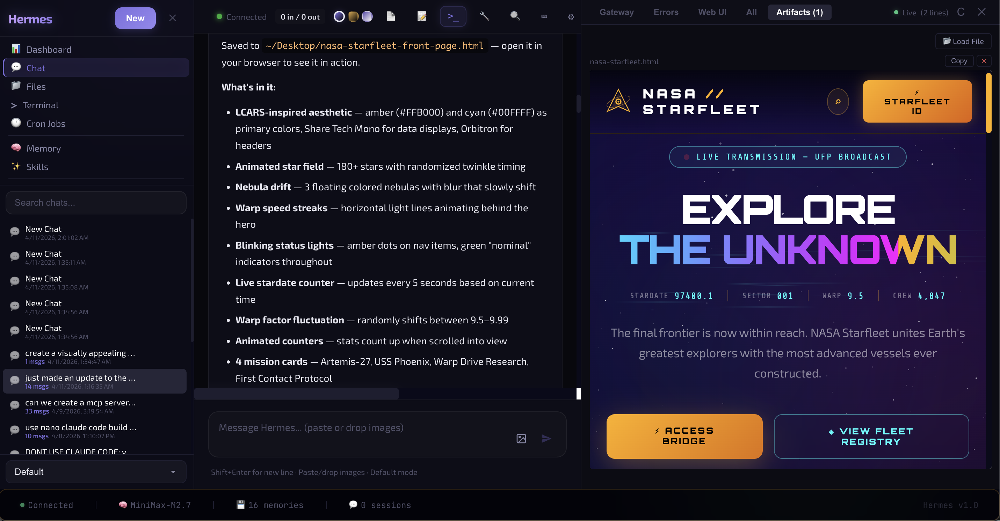

# Hermes UI

[English](README.md) · **简体中文**

一个采用毛玻璃（Glassmorphism）设计风格的 [Hermes Agent](https://github.com/pyrate-llama/hermes-agent) Web 界面 —— 让你优雅地使用自托管 AI 助手。

Hermes UI 以单文件 HTML 应用的形式构建，基于 React 18，通过一个轻量级 Python 代理服务器，为你提供完整的聊天界面、实时日志流、文件浏览、记忆管理等一系列功能。


> [!NOTE]
> **Karpathy 风格的行为准则是可选功能，默认关闭。**
> 启用后，新对话会附加一段系统提示，强制遵循四条编码原则：*写代码前先思考、优先简洁、外科手术式改动、目标驱动的执行*。这会让 Hermes 变成一个严谨、有边界感的代码协作者 —— 适合专注的编码任务，但在一些只需要直接调用技能的场景下可能导致过度思考。因此默认是关闭的。
>
> 在 **设置 → 通用 → 应用 Karpathy 行为准则** 中启用。该设置只对新对话生效 —— 已有对话会保留它们最初的设置。提示词文本位于 [`behavioral_guidelines.md`](behavioral_guidelines.md)，可自由编辑。

### Artifacts 面板


### Midnight（默认）


### Twilight


### Dawn


---

## 功能特性

**聊天界面**
- 基于 SSE 的流式传输，实时显示 token
- 工具调用可视化，结果可展开查看
- 消息编辑与重新发送
- 图片粘贴/拖拽，配合 Gemini 进行视觉分析
- 流式生成过程中支持暂停、插话与停止
- 多种人设模式（默认、技术、创意、海盗、二次元等）
- 支持将对话导出为 PDF 和 HTML
- Markdown 渲染 + 代码块语法高亮

**仪表盘**
- 实时自动刷新的统计数据（会话数、消息数、工具调用、token 消耗）
- 系统信息面板（模型、服务商、运行时长）
- Hermes 配置总览

**Artifacts 面板**
- 作为实时终端面板的第 5 个标签页（与 Gateway、Errors、Web UI、All 并列）
- 自动识别 Hermes 回复中的 HTML、SVG 和代码块并实时渲染
- 自动识别 Hermes 保存到磁盘的文件路径（如 `~/Desktop/page.html`）并自动加载 —— 无需复制粘贴代码
- 当 Artifacts 标签被激活时，面板会从 320px 动态扩展至 600px
- HTML/SVG 通过沙盒化 iframe 渲染，完整支持动画与 JavaScript
- Python、JS、CSS 等多种语言的语法高亮代码块
- 每个 artifact 都有独立的复制与关闭（✕）按钮
- 提供手动"加载文件"按钮，可直接打开本地 HTML/SVG/代码文件
- 切换标签时保留滚动位置

**终端**
- 多标签页界面：Gateway、Errors、Web UI、All —— 通过 SSE 实时流式输出日志
- 实时连接状态指示器 + 行数统计

**文件浏览器**
- 浏览 `~/.hermes` 目录树
- 直接查看和编辑配置文件、日志、记忆文件
- 支持图片预览

**记忆查看器**
- 查看并编辑 Hermes 内部记忆（MEMORY.md、USER.md）
- 实时内存占用统计

**技能浏览器**
- 搜索并浏览所有已安装的 Hermes 技能
- 支持按最新、最早、名称排序 —— 查看 Hermes 近期创建了什么
- 每个技能显示相对时间戳（如"2 小时前"、"3 天前"）
- 查看技能的描述、标签和触发短语

**任务监控**
- 跟踪活跃中和最近的 Hermes 会话
- 每个会话的消息数、工具调用数、token 数
- 每 10 秒自动刷新

**MCP 工具浏览器**
- 浏览所有已接入的 MCP 服务器及其工具
- 查看工具描述与状态

**UI/UX**
- 毛玻璃设计 + 环境光晕动画
- 可折叠的侧边栏与右侧面板
- 系统状态栏（连接、模型、记忆数、会话数）
- Inter + JetBrains Mono 字体
- 丰富的键盘快捷键
- 主题切换器（Midnight、Twilight、Dawn）
- 针对平板和手机的响应式布局
- 小屏幕下提供底部导航栏，快速访问关键视图
- 触摸优化的点击目标 + 刘海屏安全区适配

---

## 快速上手

### 前置要求

- Python 3.8 或更高版本
- 一个在 `localhost:8642` 上运行的 [Hermes Agent](https://github.com/pyrate-llama/hermes-agent) 实例
- （可选）[Claude Code CLI](https://docs.anthropic.com/en/docs/claude-code)，用于 Claude 终端标签页

### 安装与运行

```bash
# 克隆仓库
git clone https://github.com/pyrate-llama/hermes-ui.git
cd hermes-ui

# 启动代理服务器
python3 serve_lite.py

# 或者指定端口
python3 serve_lite.py --port 8080
```

> **说明：** 为了向后兼容，`serve.py` 仍然保留，但只是一个打印弃用提示并转发到 `serve_lite.py` 的壳。已有的 systemd 服务和启动脚本会继续工作，但新部署请直接调用 `serve_lite.py`。

在浏览器中打开 **http://localhost:3333/hermes-ui.html**。

就这样 —— 不需要 `npm install`、不需要构建步骤、除了 Python 标准库之外没有任何依赖。

### 配置

代理服务器默认连接到 `http://127.0.0.1:8642` 上的 Hermes。如需修改，编辑 `serve_lite.py` 顶部的 `HERMES` 变量即可。

若需使用图片分析（在聊天中粘贴/拖拽图片），请在 UI 的设置弹窗中填入你的 Gemini API Key。

### 使用 OpenRouter 或自定义推理端点

Hermes 支持任何兼容 OpenAI API 格式的推理端点，这意味着你可以通过 [OpenRouter](https://openrouter.ai) 用一个 API Key 同时访问 Claude、GPT-4、Llama、Mistral 等数十种模型。

在 `~/.hermes/config.yaml` 中配置：

```yaml
inference:
  base_url: https://openrouter.ai/api/v1
  api_key: sk-or-v1-your-openrouter-key
  model: anthropic/claude-sonnet-4-20250514
```

这同样适用于其他兼容的服务，比如 [LiteLLM](https://github.com/BerriAI/litellm)（自托管代理）、[Ollama](https://ollama.ai)（`http://localhost:11434/v1`），或任何支持 OpenAI chat completions 格式的端点。

---

## 远程访问（Tailscale）

借助 [Tailscale](https://tailscale.com) —— 一个基于 WireGuard 的零配置 Mesh VPN —— 你可以从手机、平板或任何设备访问 Hermes UI。无需暴露公网端口、无需配置 DNS、流量端到端加密。

1. **在运行 Hermes 的服务器上安装 Tailscale：**
   ```bash
   brew install tailscale    # macOS
   # 或: curl -fsSL https://tailscale.com/install.sh | sh   # Linux
   tailscale up
   ```

2. **在手机/其他设备上安装 Tailscale：** 下载 App（iOS/Android）并用同一账号登录。

3. **连接：** 查看服务器的 Tailscale IP（`tailscale ip`），然后访问：
   ```
   http://100.x.x.x:3333/hermes-ui.html
   ```

4. **可选：通过 Tailscale Serve 启用 HTTPS：** 获得真正的证书和干净的 URL：
   ```bash
   tailscale serve --bg 3333
   # 访问地址：https://your-machine.tail1234.ts.net
   ```

UI 内置了配置向导，位于 **设置 → 远程访问**。

---

## 架构

```
┌─────────────┐    ┌────────────────┐    ┌──────────────────┐
│  浏览器       │───▶│  serve_lite.py │───▶│  Hermes Agent    │
│  (React 18)  │    │  端口 3333       │    │  端口 8642         │
│              │◀───│  代理 +         │◀───│  (WebAPI)        │
│  单文件 HTML   │    │  日志流         │    │                  │
└─────────────┘    └────────────────┘    └──────────────────┘
```

- **`hermes-ui.html`** —— 整个前端都在这一个文件里：React 组件、CSS、HTML 标签一应俱全。使用 Babel Standalone 在浏览器中即时编译 JSX。
- **`serve_lite.py`** —— 一个轻量的 Python 代理（仅使用标准库，不依赖任何 pip 包）。它负责提供静态文件、将 `/api/chat/*` 的两步式 SSE 请求转发到 Hermes Agent、通过 SSE 推送日志流、提供 shell/Claude CLI 执行能力，以及在 `~/.hermes` 范围内提供文件浏览与编辑。这是当前的标准服务端脚本。
- **`serve.py`** —— 向后兼容的壳。打印弃用提示后直接 exec 到 `serve_lite.py`。保留是为了让已有的 systemd 服务和启动器不会坏掉。

### CDN 依赖

所有依赖都在运行时从 cdnjs.cloudflare.com 加载：

| 库 | 版本 | 用途 |
|---------|---------|---------|
| React | 18.2.0 | UI 框架 |
| React DOM | 18.2.0 | DOM 渲染 |
| Babel Standalone | 7.23.9 | JSX 即时编译 |
| marked | 11.1.1 | Markdown 解析 |
| highlight.js | 11.9.0 | 代码语法高亮 |
| Inter | — | UI 字体（Google Fonts）|
| JetBrains Mono | — | 代码/终端字体（Google Fonts）|

---

## 键盘快捷键

| 快捷键 | 操作 |
|----------|--------|
| `Enter` | 发送消息 |
| `Shift+Enter` | 输入框内换行 |
| `?` | 显示键盘快捷键 |
| `Ctrl/Cmd+K` | 聚焦搜索 |
| `Ctrl/Cmd+N` | 新建对话 |
| `Ctrl/Cmd+\` | 切换侧边栏 |
| `Ctrl/Cmd+E` | 将对话导出为 Markdown |
| `Escape` | 关闭弹窗 / 取消 |

---

## 主题

Hermes UI 内置三套主题，可通过顶栏的主题切换器选择：

- **Midnight**（默认）—— 深靛紫色毛玻璃，搭配环境紫光与绿光晕
- **Twilight** —— 暖金色调，点缀铜色
- **Dawn** —— 柔和的浅色主题，蓝灰色调，适合白天使用

---

## 故障排查

**Hermes 几条消息后就不响应了 / 卡住了**

如果 Hermes 回复一两次之后就没动静了，检查一下 `~/.hermes/config.yaml` 中上下文压缩部分是不是踩到了这个坑：

```yaml
compression:
  summary_base_url: null   # ← 这会导致 404 并卡住 agent
```

把 `summary_base_url` 设为你的推理服务商对应的 base URL 就能修好。例如 MiniMax：

```yaml
compression:
  summary_base_url: https://api.minimax.io/anthropic
```

然后重启 Hermes：`hermes restart`

---

**对话卡住、静默超时、或 `/api/chat/start` 返回 404**

两个常见原因：

1. **你在某个旧 checkout 或 systemd 服务里直接运行了老的 `serve.py`。** 现在的客户端（`hermes-ui.html`）使用的是两步式 `/api/chat/*` SSE API，只有 `serve_lite.py` 实现了它。如果你的启动器调用的是 `python3 serve.py`，请 pull 最新代码 —— 新版 `serve.py` 是一个会转发到 `serve_lite.py` 的壳，能继续工作。如果你在老版本上，请把服务单元直接指向 `serve_lite.py`：

   ```
   ExecStart=/usr/bin/python3 /path/to/hermes-ui/serve_lite.py
   ```

2. **Hermes agent 本身（端口 8642）不可达。** 端口 3333 上的 `serve_lite.py` 只是个代理 —— 它需要 agent 在 8642 端口运行。用 `curl http://127.0.0.1:8642/health` 检查一下。

如果还是静默卡住，打开浏览器控制台 —— 现在客户端会把 SSE 错误作为可见的聊天消息显示出来，而不是无声地卡死。

---

## 许可证

MIT —— 详见 [LICENSE](LICENSE)。

---

## 致谢

由 [Pyrate Llama](https://pyrate-llama.com) 与 Claude（Anthropic）共同打造。

基于 [Hermes Agent](https://github.com/pyrate-llama/hermes-agent) 构建。
